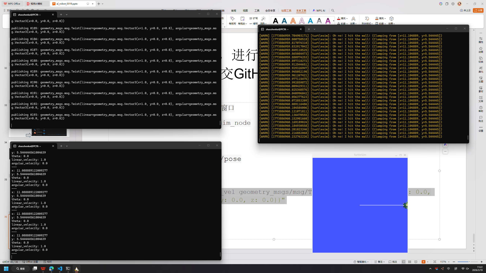

1.设置github ssh密钥并进行ubuntu里的命令行交互
2.设置vs code 与wsl ubuntu交互
3.运行小乌龟节点，进行ros命令行交互
设置github ssh密钥并进行ubuntu里的命令行交互
why
代码管理工具git是程序员最基本的工具，掌握命令行交互方式是优雅的程序员必备能力

命令行交互以外，web/destop app/第三方工具（如vs code）也可以做git代码管理
最基本的git指令
最基本的git指令
vs code是一个代码编辑器，可以有很多工具调用，比如链接到远程服务器的工具。在wsl环境下，直接访问虚拟机ubuntu有一定困难，所以使用vs code链接到虚拟机进行文件操作/代码编辑。

1.下载安装
2.配置wsl工具
3.连接到wsl目录

注意：vs code的git管理功能以及其他辅助编程工具，建议先不要使用
链接到虚拟机ubuntu的两个途径

1.wsl工具里的代开
2.vscode左下角的连接图标
3.初次连接完成后的机器可在左侧远程服务中可以看到
左侧1是文件浏览
上方右侧2是关闭左侧侧边栏
上方右侧3是打开下方工具栏（一般是自动打开命令行）
包：软件包，程序合集，比如说小乌龟仿真就是一个包

节点：机器人网络里的一个点，可以被访问的个体

话题：可以被操作的对象
服务：对象可以怎么被操作（接受指令）
3.运行小乌龟节点，进行ros命令行交互
（这是作业，需提交GitHub）

