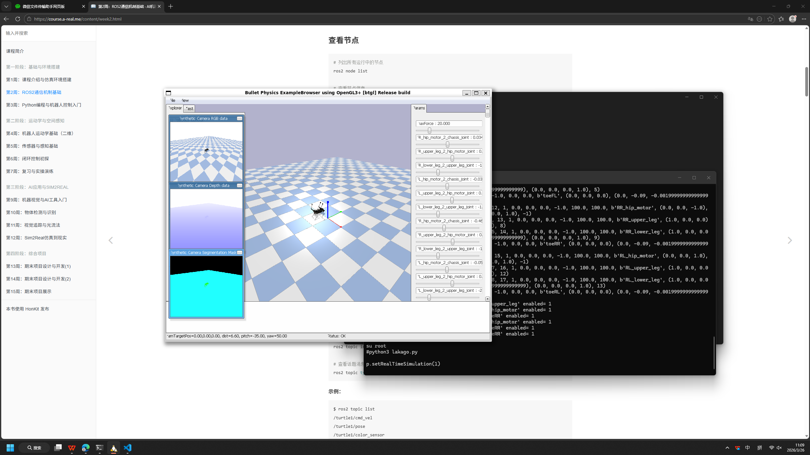
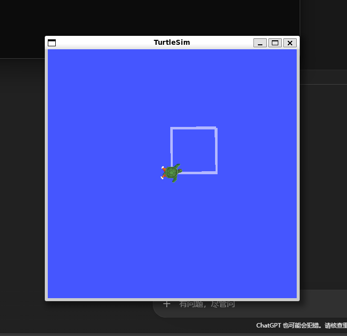

编程基础概念说明
机器人基础概念说明
运行程序作业
大四的一场面试
我问：你们开发使用什么工具（我当时期待对方的回答是C++的开发工具visual studio或者单片机的开发工具keil）
面试官：文本编辑器，记事本就可以，我们是开发内核的
当时内心震撼了：记事本可以开发程序

开发软件然后运行的本质：
程序（文本）➡编译（c/c++,完整转换后执行）/解释(java/python，逐行执行时候转换)为可执行文件（二进制的机器码）➡运行于各类平台（GUI可有可无）
平台：计算机/手机系统（win,linux,mac，ios，安卓）、芯片平台(x86/amd64/arm64)、嵌入式系统（win ce/实时操作系统）、GPU(并行计算平台)、嵌入式设备（单片机、arduino、树莓派）、DSP数字信号处理器/可编程控制器FPGA

命令行：运行系统内核的控制中心。也叫终端，CLI工具。优雅（古早）程序员的必备能力。

图形界面GUI：面向普通用户的程序
物理机：买房

虚拟机：租房 vmware workstation/wsl（微软官方的虚拟机构架）

容器化：开房间 docker（window可以基于wsl运行）
每个应用有独立环境
192.168.0.1 是什么？
ipv4地址
ipv6地址 教育网
dns（服务器）地址

广域网/局域网/本机回环地址127.0.0.1
外网/内网
确认外网地址：浏览器打开 https://www.ip138.com
网络确认指令： ping ip地址/网址
安全外壳协议
软件版本的管理需要安全，git 可使用ssh连接远程服务器

更常用的用法
ssh root@110.110.110.110

安全外壳协议   用户名@远程/局域网计算机的地址
目的：为了安全

root 具有完整的控制权限，最底层的有风险的操作（如硬件、数据库、网络）

sudo 一条普通用户登陆时可以执行root权限的指令前缀

普通用户：就是普通

su 用户名 切换登陆用户 
exit 退出登陆用户
sudo bash 登陆root用户（su root有时不可用）
/ 根目录
. 当前目录
.. 上一级目录
~ 用户目录 例如：/home/robot = ~
pwd 命令行输出当前目录地址
cd 要去的目录地址
mv  现在存在的地址/文件         移动或重命名后的地址/文件
ls 列出当前目录文件
ls 要列出目录的文件目录地址 
git 是程序版本管理工具（其他管理工具还有svn），就像游戏存档，代码写错了出问题了可以回退，多个人写代码可以互相独立开发然后合并工作。
本地目录+git init =加入版本控制的git本地仓库，如需长期保存代码，就要使用远程服务器，就像我们把照片放到网盘里。
github是git最常用的远程服务器仓库，也可以使用其他服务器，比如gitee,gitlab（可以自建代码管理服务器）
ssh-keygen -t ed25519 -C “your@email”     
     生成ssh密钥（ed25519是一种加密标准）输出了两个文件
ls ~/.ssh
id_ed25519  id_ed25519.pub

密钥私钥       密钥公钥

cat ~/.ssh/id_ed25519.pub  读取显示内容输出在命令行里cat
sudo apt install python

cd 程序所在目录
python3 程序名字.py (有时候需要用python) 

python 的包管理器 pip (有时候需要使用pip3) 安装
sudo apt install python3-pip
pip3 install pybullet 安装仿真用的物理引擎库
运行机器狗仿真程序
代码链接（2.2 完整代码）：https://course.a-real.me/content/week3.html
先把程序文件保存好，再运行小乌龟节点
运行python程序控制自己的小乌龟

