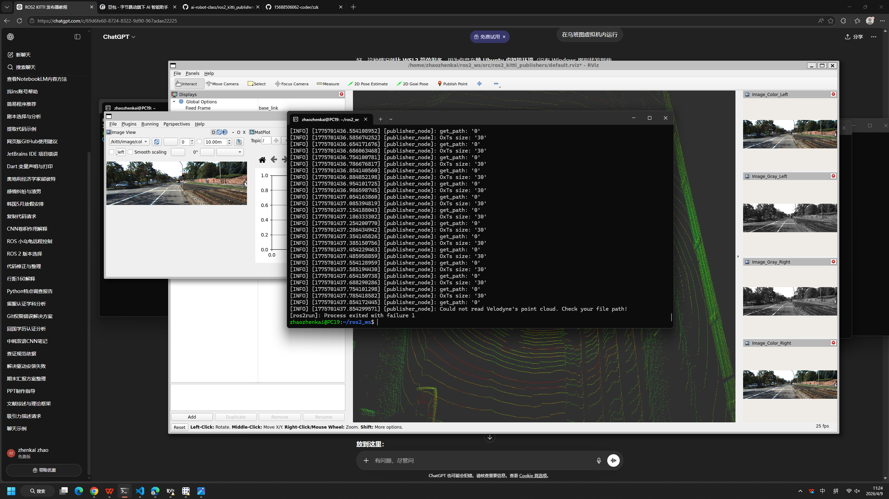

复习
传感器介绍
传感器ros2 实验
homework
去哪里？ cd 要去的文件夹/目录/绝对路径/相对路径
在哪？     pwd
有啥？     ls 省略/相对路径/绝对路径
                带参数的  ls -a 所有文件和文件夹,ls -l 详细情况
sudo权限指令 在普通用户状态下，执行高权限指令
例如：安装新的软件 sudo apt install 软件名字，sudo reboot

切换用户 su 用户名/ sudo bash
mv 移动文件夹/重命名
rm 删除指令 
带参数的指令：rm -r 删除文件夹, rm -rf程序员删库跑路指令
1.跨越虚拟机/服务器
与物理机/操作机的界限
Pycharm配置参考
2.多样化的插件和
丰富的功能：
markdown渲染

3.减少终端的文本编辑操作
常见的终端文本编辑器 vim nano vi
4.可以直接编辑隐藏文件
.gitignore
可以在存储库的根目录中创建 .gitignore 文件，指示 Git 在提交时要忽略哪些文件和目录。 若要与克隆存储库的其他用户共享忽略规则，请将 .gitignore 该文件提交到存储库中。
cd 程序文件夹
git add .
git commit -am “描述提交代码的目的”
git push

版本管理的本质:    
程序文件夹根目录下 .git 目录（隐藏文件夹）
分支/版本
激光雷达：2D,3D
声纳（水中机器人使用）
相机：单目/双目,深度,RGB-D
触觉
imu 惯性测量单元
GPS

融合数据：
1.点云/激光点云 
2.IMU + GPS + LiDAR (LIO/LVI-SAM) 无人驾驶
通过发射激光束并测量反射时间来计算距离（ToF）。
2D LiDAR：仅在单一平面扫描，常用于扫地机器人或室内 AGV 的 SLAM（即时定位与地图构建）。
3D LiDAR：多线束（如 16/32/64/128 线）扫描，产生三维空间点云，是无人驾驶感知障碍物、形状、距离的核心。

单目 (Monocular)：成本低，但无法直接获得深度信息（需通过算法/深度学习估算）。
双目 (Stereo)：模拟人眼，通过左右相机的视差（Disparity）计算深度。
RGB-D / 深度相机：
结构光（如 Kinect V1）：发射已知图案，根据畸变计算深度。
ToF（如 Kinect V2）：测量光脉冲往返时间。
特点：直接输出带有颜色信息（RGB）和深度信息（Depth）的点云，但有效距离通常较短（5米以内）。
例子：乐视体感相机
MU (惯性测量单元)
组成：通常包含三轴加速度计和三轴陀螺仪。
作用：提供高频的角速度和加速度数据，通过积分推算位姿。
痛点：存在累计误差（漂移），长时间运行会偏离真实位置。
GPS / GNSS
作用：提供全球绝对坐标。
RTK 技术：通过基准站校验，可以将定位精度从米级提升到厘米级。
痛点：更新频率低（通常 1Hz-10Hz），且在隧道、城市森林中信号易丢失。

